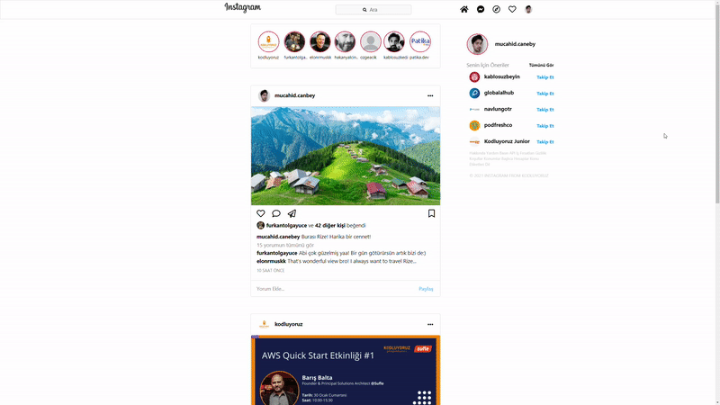

## Instagram Clone 


 

Patika.dev'in bootstrap dersinde yeni öğrendiğim bilgiler ile Instagram clone tasarladım
---



Bu repo [Kodluyoruz](https://www.kodluyoruz.org/) Front-End Eğitiminde oluşturduğum bootstrap ödev-1 . İçerisinde bir adet README dosyası, bir adet .html uzantısı ve bir adet .css uzantılı dosya barındırıyor.

## Installation

Öncelikle projeyi clonelayın.

```
https://github.com/Mucahid-Canbey/Bootstrap-Instagram-Odev-2.git
```

## Usage
Projeyi cloneladıktan sonra Visual Studio Code programında açınız.

Linux için:
```
cd kodluyoruzilkrepo
code .
```
## Contributing
Pull requestler kabul edilir. Büyük değişiklikler için, lütfen önce neyi değiştirmek istediğinizi tartışmak için bir konu açınız.

## License
[MIT](https://choosealicense.com/licenses/mit/)
